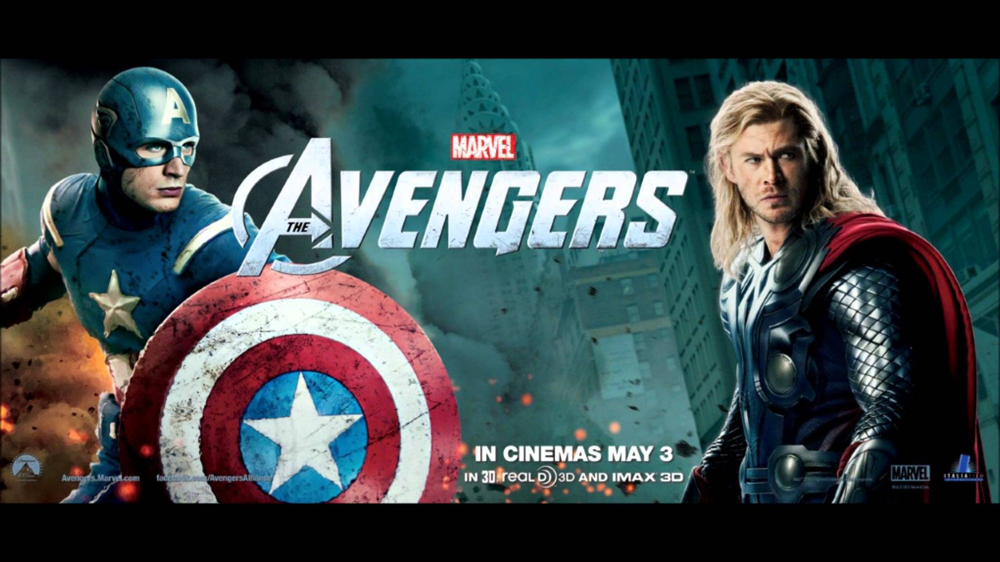
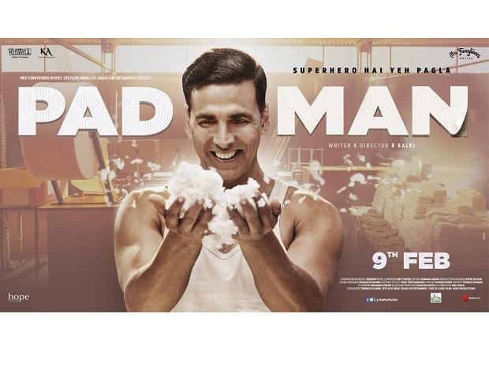
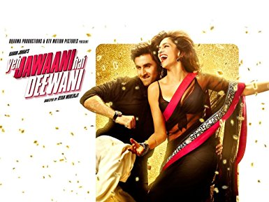
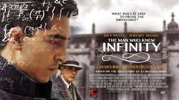
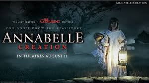
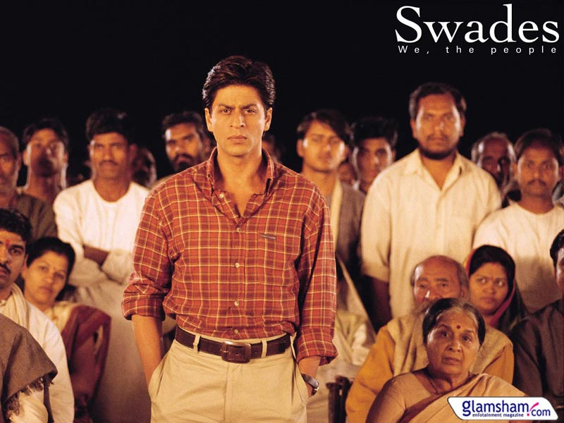

# movie-prediction-web-application-usinng-data-mining-
<!DOCTYPE html>
<html>
<title></title>
<meta charset="UTF-8">
<meta name="viewport" content="width=device-width, initial-scale=1">
<link rel="stylesheet" href="https://www.w3schools.com/w3css/4/w3.css">
<link rel="stylesheet" href="https://fonts.googleapis.com/css?family=Poppins">

<body>
<nav class="w3-sidebar w3-black w3-collapse w3-top w3-large w3-padding" style="z-index:3;width:300px;font-weight:bold;" id="mySidebar"> 
  <a href="javascript:void(0)" onclick="w3_close()" class="w3-button w3-hide-large w3-display-topleft" style="width:100%;font-size:22px">Close Menu</a>
  

    <h3 class="w3-padding-64"><b>Movie Prediction</b></h3>
  

  

    <a href="#" onclick="w3_close()" class="w3-bar-item w3-button w3-hover-white">Home</a> 
    <a href="http://www.imdb.com/" onclick="w3_close()" class="w3-bar-item w3-button w3-hover-white">*IMDB</a>
    <a href="upcoming.html" onclick="w3_close()" class="w3-bar-item w3-button w3-hover-white">Rating for upcoming movies</a> 
    <a href="#services" onclick="w3_close()" class="w3-bar-item w3-button w3-hover-white">comedy</a> 
    <a href="#designers" onclick="w3_close()" class="w3-bar-item w3-button w3-hover-white">horror</a> 
    <a href="#packages" onclick="w3_close()" class="w3-bar-item w3-button w3-hover-white">fiction</a> 
    <a href="#contact" onclick="w3_close()" class="w3-bar-item w3-button w3-hover-white">thriller</a>
    <a href="graph.html" onclick="w3_close()" class="w3-bar-item w3-button w3-hover-white">Pie chart</a>
  

</nav>
<!---------------------------------------------------------------------------------------------------------------------->

<!-- regression claculation-->

<!-- Top menu on small screens -->
<header class="w3-container w3-top w3-hide-large w3-black w3-xlarge w3-padding">
  <a href="javascript:void(0)" class="w3-button w3-yellow w3-margin-right" onclick="w3_open()">&#9776;</a>
  BOX OffiCe
</header>

<!-- Overlay effect when opening sidebar on small screens -->

<!-- !PAGE CONTENT! -->

  <h2>Predicting your movie</h2><!--for upcoming movie-->
   

  <button onclick="document.getElementById('id01').style.display='block'" class="w3-button w3-red">check status for released movie</button>
  

    

     
        &times;
        <h2></h2>
      </header>
      

    

<input class="w3-input" type="text" name="name" style="width:90%" required>
<label>Name of the movie</label>

<input class="w3-input" type="text" name="imdb" id="movie" style="width:90%" required>
<label>*IMDB Rating</label>

<input class="w3-input" type="text" name="budget" id="cost" style="width:90%" required>
<label>Budget(In crore)</label>

 

<select class="w3-select" id="genre" name="option">
  <option value="" disabled selected>
Choose Genre
</option>
  <option value="1">Action</option>
  <option value="2">Comedy</option>
  <option value="3">Drama</option>
  <option value="4">Horror</option>
  <option value="5">Thriller</option>
  <option value="6">Romantic</option>
</select>

<button onclick="rating()">Click me</button>

    

    

  

<!---------------------------------------------------------------------------------------------------------------------->
    <!--upcoming movie-->
    

   
<!---------------------------------------------------------------------------------------------------------------------->
  <!-- Header -->
  

  
   
    

  

  
  <!-- Photo grid (modal) -->
  

    

        
      
      
        
          
          

    

    

      
      
      
      
      
      
    

  

  <!-- Modal for full size images on click-->
  

    &times;
    

      
      

    

  

  <!-- Services -->
  

    <h1 class="w3-xxxlarge w3-text-black"><b>Our Services.</b></h1>
    

    
We are predicting the movie based on some facts and figures and analyse your data on some excellent data mining techniques.Data from the Internet Movie Database (IMDB) was gleaned and various data mining and prediction techniques such as multi-linear regression, regression tree and K-nearest neighbors were used to devise a model that can predict an Indian movie’s ranking with an RMSE of 1.5 on a scale of 1 to 10. 

    

    

  

  
  

   
   
  
  
 

  <button class="w3-button w3-black w3-display-left" onclick="plusDivs(-1)">&#10094;</button>
  <button class="w3-button w3-black w3-display-right" onclick="plusDivs(1)">&#10095;</button>

      

  <!-- Contact -->
  

    <h1 class="w3-xxxlarge w3-text-green"><b>Contact Us.</b></h1>
    

  
    <form action="/action_page.php" target="_blank">
      

        <label>Name</label>
        <input class="w3-input w3-border" type="text" name="Name" required>
      

      

        <label>Email</label>
        <input class="w3-input w3-border" type="text" name="Email" required>
      

      

        <label>Message</label>
        <input class="w3-input w3-border" type="text" name="Message" required>
      

      <button type="submit" class="w3-button w3-block w3-padding-large w3-red w3-margin-bottom">Send Message</button>
    </form>  
  

</body>
</html>
